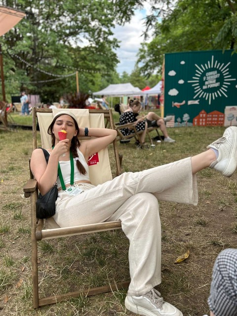

# rsschool-cv
## Katsiaryna Barysevich
### _Pre-junior JS/Front-End engineer_
--------


--------
### **Contacts**

**Phone** : +375 29 3098838

**E-mail** : k.b.germ1806@gmail.com 

**Discord(RSSchool)** : Katsiaryna Barysevich (@kbgerm) 

**Telegram** : [@kb_germ](https://t.me/kb_germ)

--------
### **About me** 
I'm a junior scientist in the National Botanical Garden, Minsk. I graduated as a microbiologist from Belarusian State University and i really like my speciality. Unfortunately, i don't work as a microbiologist because there are no work places.
Now i'm trying to change my life by studying JS and Front-end. It is a challenge for me because i've never ever succeed in programming even in school, when we were trying to understand Pascal ABC. 

--------
### **Strengths**

* communicative skills
* team player (i LOVE coop-games, i think it is a good example)
* flexible mind
* creativity

--------
### **Skills**
* HTML5 (a bit)
* CSS3 (a bit)
* JS (even less than a bit)
* Git/GitHub

--------
### **Code example**
```
function multiply(a, b){
  return a * b
}
```
--------
### **Experience** 
CV#1-rsschool

--------
### **Education**
* Belarusian State University (Biology faculty, microbiologist)
* Stepik course (Основы HTML и CSS)
* RS Schools Course «JavaScript/Front-end. Stage 0» (in progress)

--------
### **Languages**
* Russian-native
* Belorussian
* English - B2 (Streamline online test), no speaking practice
