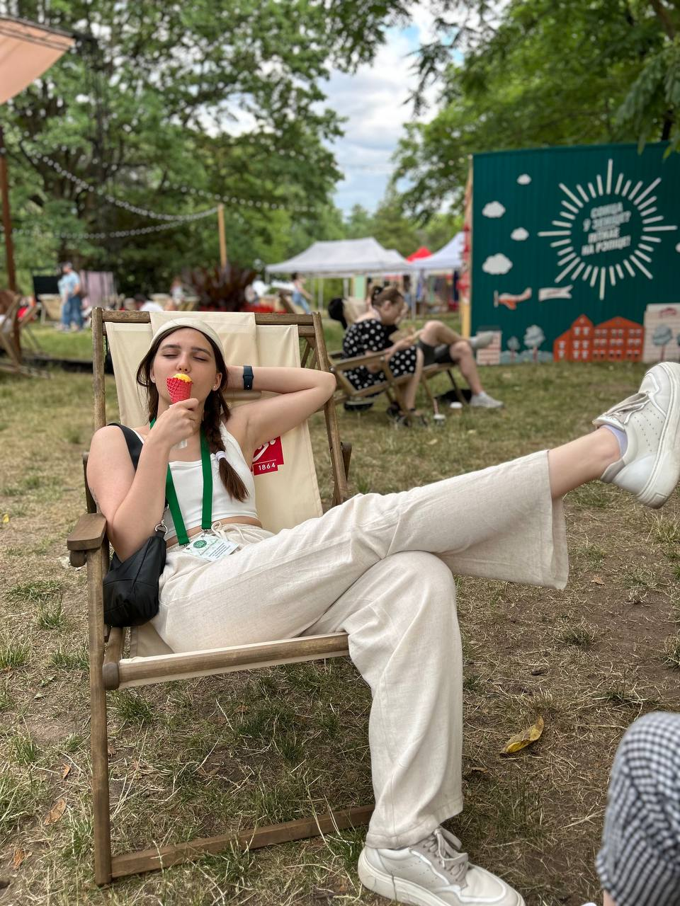

# CV
## *Katsiaryna Barysevich*
### _Pre-junior JS/Front-End engineer_
 width="600" height="300"
### *phone: +375293098838, e-mail: k.b.germ1806@gmail.com discord-rsschool:Katsiaryna Barysevich (@kbgerm) Telegram: @kb_germ*
### About me:
I'm a junior scientist in the National Botanical Garden, Minsk. I graduated as a microbiologist from Belarusian State University and i really like my speciality. Unfortunately, i don't work as a microbiologist and now i'm trying to change my life by studying JS and Front-end. 
### Strengths:
communicative skills
team player (i LOVE coop-games, i think it is a good example)
flexible mind
creativity
### Skills:
HTML (a bit)
CSS (a bit)
JS (even less than a bit)
Git/GitHub
### Code example
```
function multiply(a, b){
  return a * b
}
```
### Experience
CV#1-rsschool
### Education
Belarusian State University (Biology faculty, microbiologist)
Stepik course (Основы HTML и CSS)
### Languages
Russian-native
Belorussian
English - B2 (Streamline online test), no speaking practice
